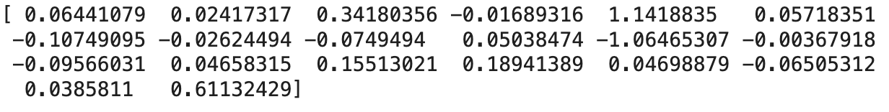
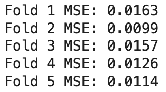

# Introduction
For our dataset, we chose to use a dataset from Kaggle that displays each country’s life expectancy, along with various features such as GDP, BMI, alcohol consumption, immunization coverage of certain diseases, etc. We chose this dataset because we wanted to predict a country’s life expectancy based on the other features. Having a good predictive model for this dataset would allow us to know which features have the most impact on life expectancy. This could have an impact on how people make decisions about their health in their everyday lives and could influence a country’s healthcare policies. 

# Methods
### Data Exploration
To explore our dataset we verified that there were no missing data or null observations in our dataset. Additionally we identified the datatypes of the features in our dataset and verified that they were all numerical except for one, ‘Country’, which was categorical. Additionally we observed that many of the features in our dataset are not normally distributed. 

### Preprocessing
We removed the categorical feature ‘Country’ from our datasets because we did not see it relevant for our model. We then decided to apply min-max normalization to our dataset because many of the features were not normally distributed, as noted in the Data Exploration section. Additionally we split our dataset into a training and test set with a 80:20 split.

### Model 1
For our first model we chose to do a linear regression model with a degree of 1. Our input matrix included the normalized features in our training set apart from ‘Life Expectancy’ which was used as the dependant feature. The features in our input matrix included "infant deaths", "Alcohol", "percentage expenditure", "Hepatitis B", "Measles", "BMI",  "under-five deaths", "Polio", "Total expenditure", "Diphtheria", "HIV/AIDS", "GDP", "Population", "thinness 1-19 years", "thinness 5-9 years", "Income composition of resources", "Schooling", "Year", "Status", "Life expectancy", "Adult Mortality". 

### Model 2
For our second model we chose to do a polynomial linear regression model with a degree 2. Our input matrix included the normalized features in our training set "infant deaths", "Alcohol", "percentage expenditure", "Hepatitis B", "Measles", "BMI",  "under-five deaths", "Polio", "Total expenditure", "Diphtheria", "HIV/AIDS", "GDP", "Population", "thinness 1-19 years", "thinness 5-9 years", "Income composition of resources", "Schooling", "Year", "Status", "Life expectancy", "Adult Mortality" as well as the square of the values from the previous features listed. In this step we also chose to increase the degree of the polynomial linear regression model to 3, which then added additional features in our features matrix that was the cube of the previous features listed. Our dependent feature was ‘Life Expectancy’.

# Results
### Model 1
For the results from our first linear regression model, we found that the mean squared error was fairly low for both the training data and the test data, with values of 0.0125 and 
0.0148 respectively. We also found that the r-squared values were 0.7246 and 0.6865 respectively. Additionally, here were our coefficients for the first model: 

These coefficients are for features: ["infant deaths", "Alcohol", "percentage expenditure", "Hepatitis B", "Measles", "BMI", "under-five deaths", "Polio", "Total expenditure", "Diphtheria", "HIV/AIDS", "GDP", "Population", "thinness 1-19 years", "thinness 5-9 years", "Income composition of resources", "Schooling", "Year", "Status", "Adult Mortality"]. Additionally, after performing k-fold cross validation for k = 5, we obtained these results for the mean squared error after each iteration:

Our average MSE was 0.0132. 

### Model 2
For the results of our polynomial regression model with degree two, we found that the train and test mean squared errors were 0.0102 and 0.0136 respectively. Additionally, we found that the r-squared values were 0.7752 and 0.7121, respectively. After performing k-fold cross validation for k = 5, we obtained these results for mean squared error after each iteration: 
***FIGURE HERE***
Our average MSE was 0.0138.

For the results of our polynomial regression model with degree three, our mean squared errors for the train and test sets were 0.0019 and 2379.3295, respectively. Our r-squared values were 0.9582 and -50257.8120, respectively. After performing k-fold cross validation, we obtained these results for mean squared error after each iteration:
**FIGURE HERE**
Our average MSE was 1645.2000. 

# Discussion
We began with a linear regression model in order to set a baseline for the relationships between our features and life expectancy. Linear regression models are simple and inferrable, allowing us to establish that baseline for when we are comparing more complex models. Our model performed well, achieving a training MSE of 0.0125 and a testing MSE of 0.0148. Using K-fold cross-validation, we saw consistent errors throughout the folds, hinting that our linear regression model generalizes well. We believed our results for our linear regression model align with our expectations. However, we suspected that we were underfitting the model due to the real life nature of our features and their non-linear relationships. Next, we tried polynomial regression. To address the issues like non-linear relationships in the previous model, we introduced polynomial features by squaring each input variable. We found that the second-degree polynomial model improved the results slightly, dropping the training MSE to 0.0102 and the testing MSE to 0.0136. We interpreted this shift to mean that the model was capturing more complexity than the linear regression without overfitting. This would have been the case hadn’t we shifted the polynomial degree to three. When we tried a third-degree polynomial model, our testing error exploded to 2379.33. We were very distraught by this outcome initially but, eventually chalked it up to overfitting. From this milestone we also learned that, when we squared our features, it treated them equally implying that every feature is equally as important when predicting life expectancy, which is not representative of their real life relationships. Although the second-degree polynomial model performed to our expectations, increasing the degree made us realize there is much more room for improvement. The overfitting was a sign that we needed better regularization and feature selection.  

# Conclusion
Overall we are fairly satisfied with how the project went, but we wish that we could have expanded to even more complicated models. We kept our model 1 and model 2 relatively simple as they were the first logical models to try for our dataset, and we found some meaningful results, experiencing overfitting when we were tuning our second model and discovering that we can actually make fairly accurate predictions based on just a linear combination of all of our features. As for future directions we would definitely want to get more models trained in general to see if we can do better than we already did. Since we just started learning about neural networks, it would be interesting to see how well they can make predictions about our data, and also we are curious to see how much a neural network model would tend to overfit compared to the overfitting that we experiences when tuning for our polynomial model. Unfortunately we don’t think we quite have the time to get this implemented due to our busy schedules, so that will have to be done later. Insert final thoughts

# Statement of Collaboration
During this project, we had a meeting for each milestone where we all got to work at the same time until the milestone was done! That’s why we aren’t really sure what to give for the titles, since we all sort of did every aspect of the project, we rotated and got slightly different parts done each milestone, but we all worked together at the same time. We all coordinated on discord when we would meet.

Name: Annie Ping 	Title: Meetings leader, Codewriter, Writer	
Contribution: Write up for two of the milestones, code for training our second model, ¼ of this final report

Name: Sierra Myers	Title: Codewriter,  Writer
	Contribution: Write up for one of our milestones, code for training our first model, ¼ of this final report

Name: Taylin Kieu	Title: Codewriter, Writer 
	Contribution: Write up for one of our milestones, code for making a fitting graph for our models, ¼ of this final report

Name: Liam Hardy	Title: Codewriter, Writer
	Contribution: Write up for one and a half of the milestones, one fully and the other adding on after someone else's. Code for K-fold cross validation and cleaning up all of our code

